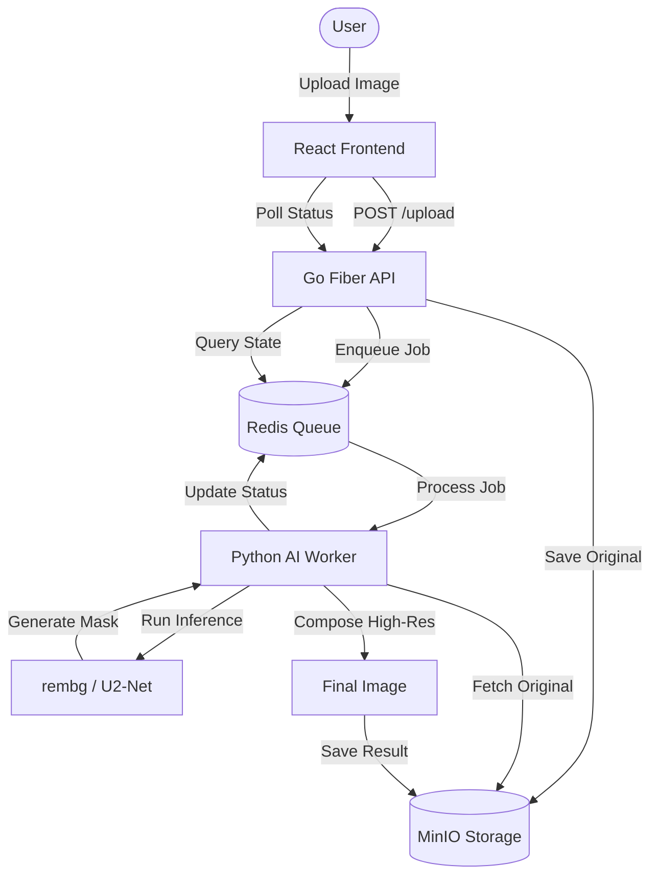

# <p align="center"><br>NanoBGR</p>


---

## 📖 Table of Contents
- [Português](#-português)
- [English](#-english)
- [Tech Stack](#-tech-stack)
- [Architecture](#-architecture)
- [Getting Started](#-getting-started)
- [API Reference](#-api-reference)

---

## 🇧🇷 Português

**NanoBGR** é um sistema de processamento de imagens escalável, projetado para remover fundos de fotos em alta resolução sem perda de qualidade. Utilizando uma arquitetura de microserviços, o projeto separa a interface de usuário, a orquestração de tarefas e a inferência de IA para garantir máxima eficiência.

### ✨ Diferenciais
- **Alpha Matting de Alta Precisão**: Mantém detalhes finos como cabelo e bordas translúcidas.
- **Processamento Assíncrono**: Gerenciamento de filas via Redis para suportar múltiplos uploads simultâneos.
- **Storage S3-Compatible**: Integração com MinIO para armazenamento seguro e rápido de ativos.

---

## 🇺🇸 English

**NanoBGR** is a scalable image processing system designed to remove backgrounds from high-resolution photos without quality loss. By leveraging a microservices architecture, the project decouples the user interface, task orchestration, and AI inference to ensure maximum efficiency.

### ✨ Key Highlights
- **High-Precision Alpha Matting**: Preserves fine details like hair and translucent edges.
- **Asynchronous Processing**: Queue management via Redis to handle multiple simultaneous uploads.
- **S3-Compatible Storage**: MinIO integration for secure and fast asset storage.

---

## 🛠 Tech Stack

| Component | Technology | Role |
| :--- | :--- | :--- |
| **Frontend** | React + Vite + CSS Modules | Modern Dashboard & UI |
| **API Gateway** | Go (Fiber) | Fast Uploads & Job Orchestration |
| **Worker** | Python (rembg + OpenCV) | AI Inference & Image Composition |
| **Queue** | Redis | Async Task Distribution |
| **Storage** | MinIO | Object Storage (S3-Compatible) |
| **Container** | Docker & Docker Compose | Infrastructure Orchestration |

---

## 🏗 Architecture

The following diagram illustrates the flow from image upload to final processing:



---

## 🚀 Getting Started

### Prerequisites
- [Docker](https://www.docker.com/)
- [Docker Compose](https://docs.docker.com/compose/)

### Installation

1. **Clone the repository:**
   ```bash
   git clone https://github.com/brnmd96/NanoBGR.git
   cd NanoBGR
   ```

2. **Set up environment variables:**
   ```bash
   cp .env.example .env
   ```

3. **Launch the stack:**
   ```bash
   docker-compose up --build
   ```

The services will be available at:
- **Frontend**: [http://localhost:5173](http://localhost:5173)
- **API**: [http://localhost:3000](http://localhost:3000)
- **MinIO Console**: [http://localhost:9001](http://localhost:9001)

---

## 📡 API Reference

### Upload Image
`POST /upload`
```bash
curl -F "image=@your_photo.jpg" http://localhost:3000/upload
```

### Check Job Status
`GET /status/:id`
```bash
curl http://localhost:3000/status/{UPLOAD_ID}
```

---

## 📝 Changelog
Stay updated with latest improvements in [CHANGELOG.md](./CHANGELOG.md).

---
